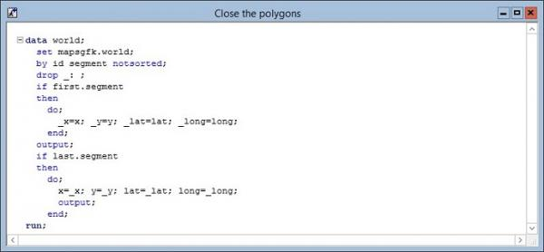
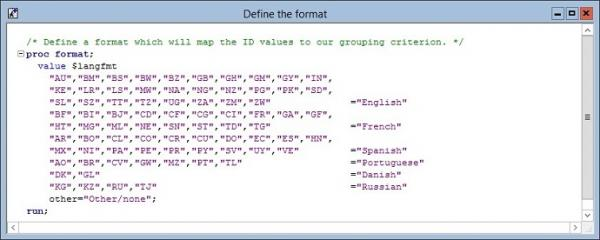
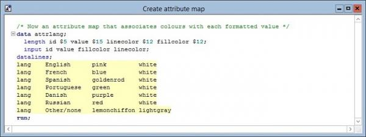
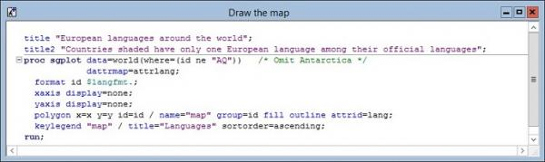
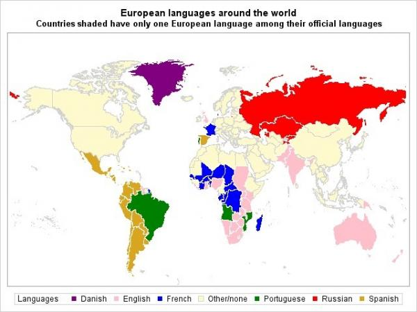

# Plotting and Shading Maps with ODS Graphics

ODS Graphics does not have any procedures that deal specifically with maps, but it can plot polygons, and the areas on a map are just a set of polygons. Map data sets are supplied by SAS Institute with the SAS/Graph product (i.e. traditional SAS graphics), and if these are available they can be plotted using ODS Graphics facilities. Some data preparation is needed. The first thing to do is to make sure that all the polygons in the map are closed i.e. that they begin and end at the same point.   
  
The NOTSORTED option on the BY statement is essential to the success of this step. When SAS sorts a data set, the list of BY variables used is recorded in the data set header. A BY statement in a data step normally uses this information to check whether the data set is correctly sorted. The NOTSORTED option tells it not to worry about this. It is in the nature of map data sets that all the records for the same “segment” (i.e. polygon) will be contiguous and in order.

This data step saves the first record for each segment, and repeats it after the last record of the segment. So all polygons will now be closed.

The next stage is to define a format which is going to be used to determine the fill colours for the polygons, which in this case represent countries. The example plot is going to colour countries according to the languages spoken. This format maps ID, a 2-character country code from the map data set, to the name of a language.  
  
The final piece of preparation is to define an attribute map which specifies the colours to be used for each of these languages.  
  
The map can now be plotted.  
  
The options on the POLYGON statement are crucial to everything that is happening here.

* NAME names the polygon plot so that it can be used in the KEYLEGEND statement which follows, to specify a non-standard legend.
* GROUP=ID specifies the grouping variable, which in this context means the variable whose (formatted) values are going to be used for lookups against the attribute map. A FORMAT statement within Proc SGPLOT is specifying the $LANGFMT format just defined, so each of these formatted values will be the name of a language.
* FILL and OUTLINE specify that every polygon (country) is to be filled and outlined.
* ATTRID=LANG specifies the attribute ID to be used within the attribute map. The name of the attribute map to be used is specified by the DATTRMAP option on the Proc SGPLOT statement.

The plot produced is:  
  
Complete factual accuracy is not guaranteed, but the lack of shading in North America is correct, because Canada has two official languages, while the USA, surprisingly, has none.

 

 
